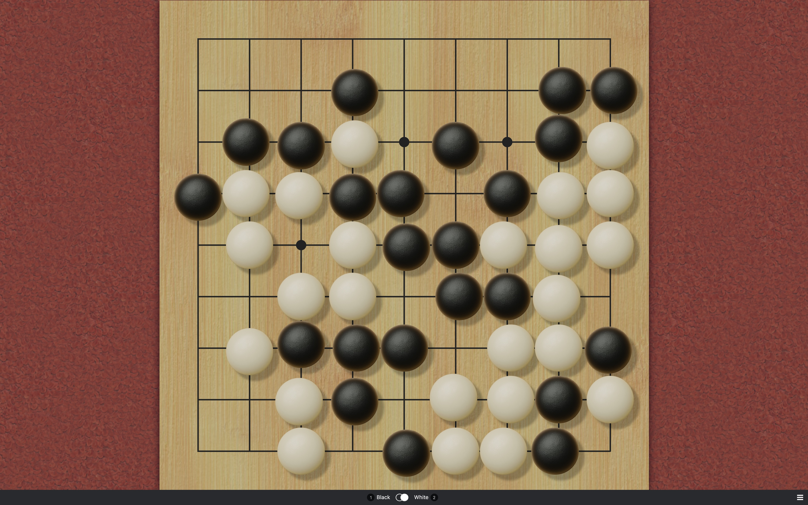
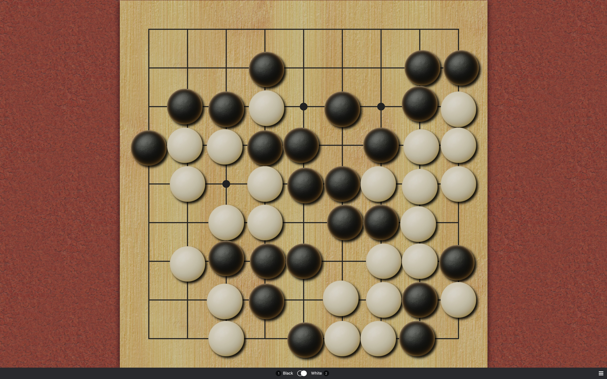
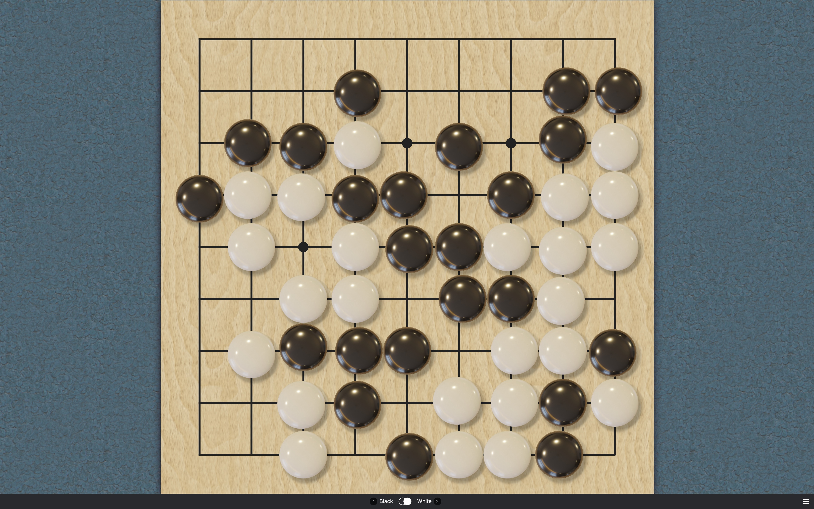
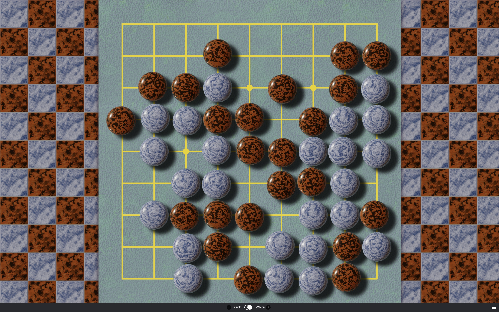
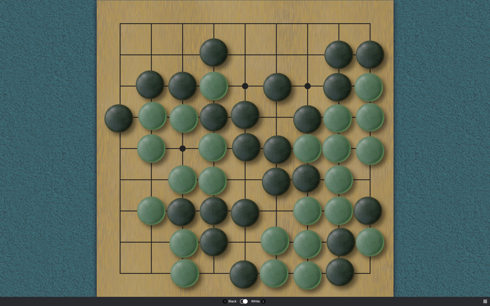
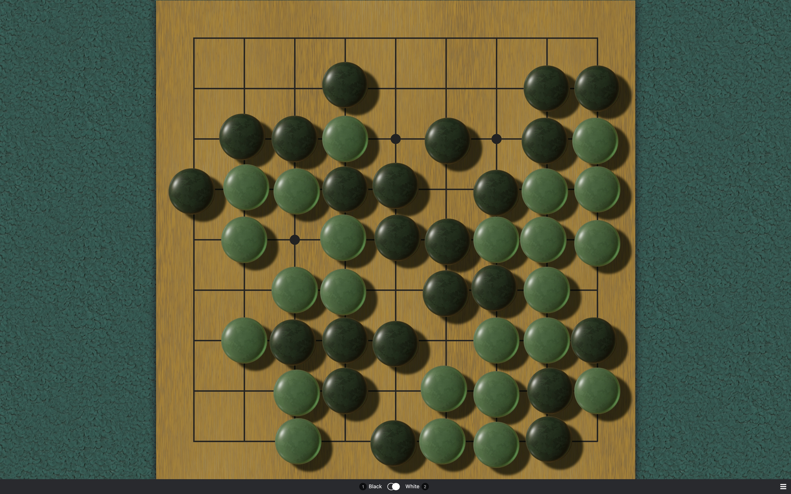
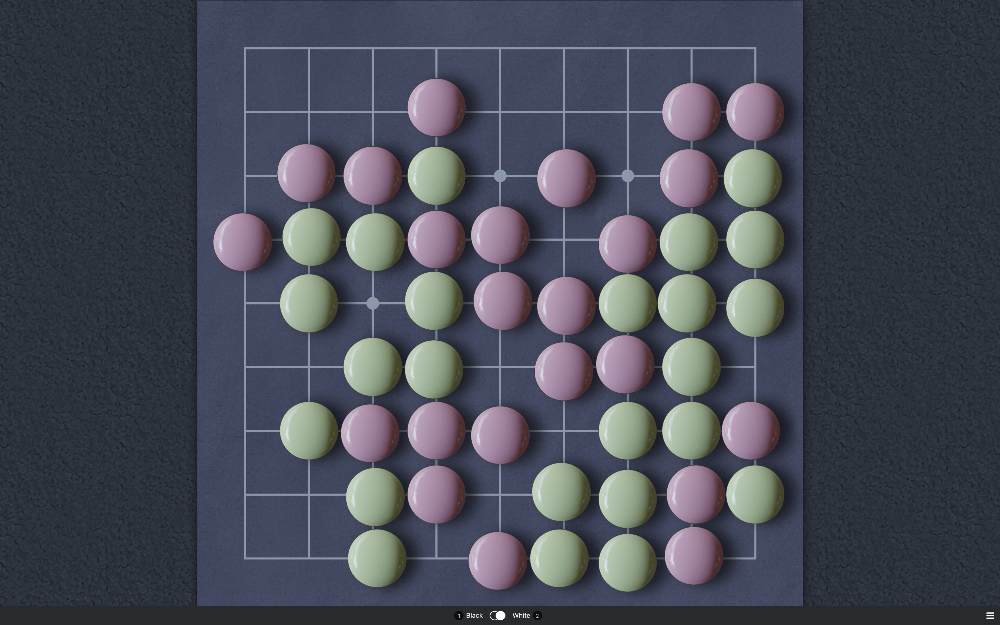
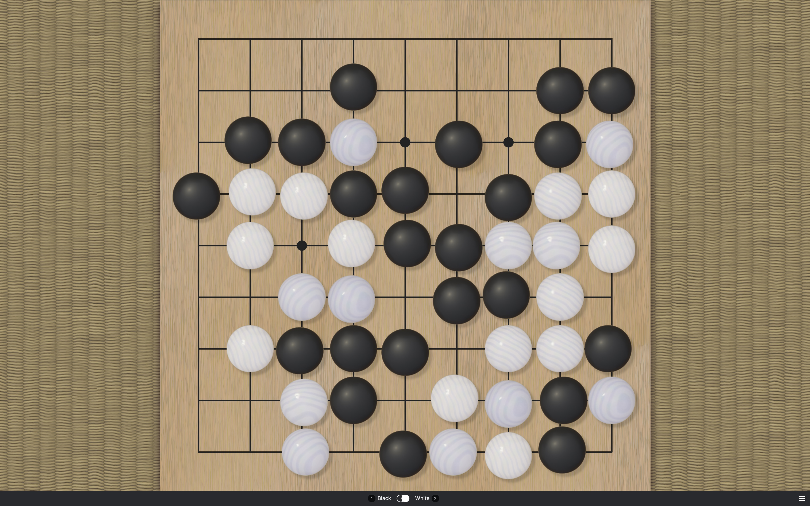
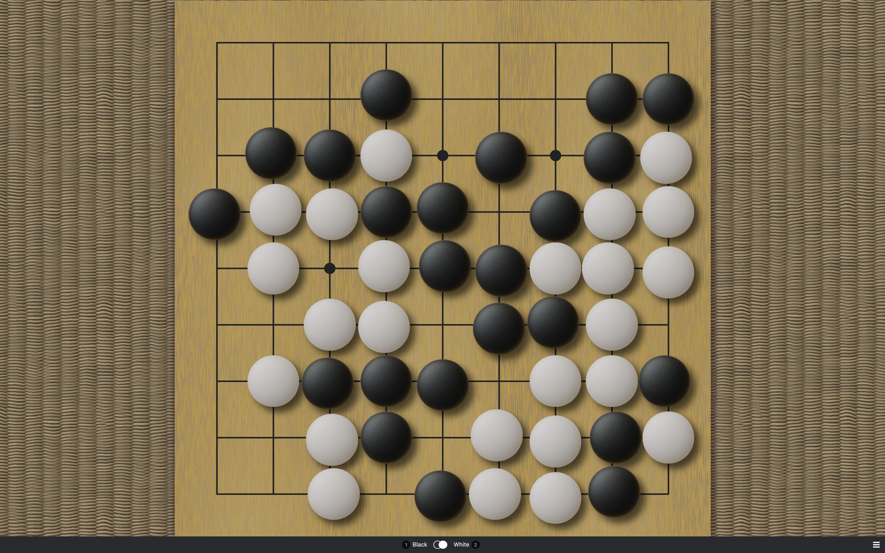
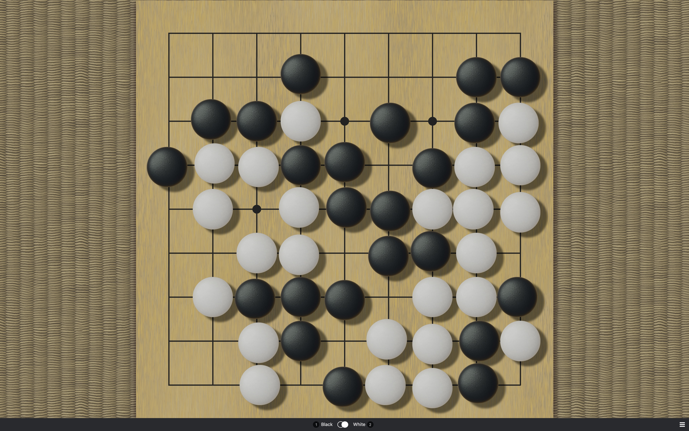

# SabakiThemes

A collection of themes for [Sabaki](https://github.com/SabakiHQ/Sabaki), done in [Blender](https://www.blender.org/).

## Installation

[Download](https://github.com/billhails/SabakiThemes/releases) the theme files and install them directly inside Sabaki
under 'Preferences' > 'Themes' > 'Install Theme...'.

## Screenshots

| Theme                                        | Screenshot                                     |
| -------------------------------------------- | ---------------------------------------------- |
| [antique](antique)                           |           |
| [antique](antique-hard) (hard light)         |      |
| [basic](basic)                               |             |
| [bathroom](bathroom)                         |          |
| [jade](jade)                                 |              |
| [jade](jade-hard) (hard light)               |         |
| [sakura](sakura)                             |            |
| [shell-slate](shell-slate)                   |       |
| [shell-slate](shell-slate-hard) (hard light) |  |
| [yunzi](yunzi)                               |             |
| [yunzi](yunzi-hard) (hard light)             |        |

## Resources

The `.blend` file used to generate these themes, plus its resources
and a description, are now available in the [blender](blender)
directory. I'd consider pull requests but I'm not initially too keen,
its mainly for the curious.

## Note on the "hard light" variants

To better match the lighting, I'd rendered out previews of a couple
of stones and the board for each theme (see
[blender/previews](blender/previews)), so that I could then refer
to those images and adjust the css drop shadows to match. Having
done that, I realised that some of the shadows, while much more
faithful to the actual lighting, are quite extreme and some people
might find them distracting. For that reason those more extreme
themes have been renamed to `-hard` variants, and "softer" variants
have replaced the originals. Let me know which you prefer.

## License

Everything is released under [public domain](http://creativecommons.org/publicdomain/zero/1.0/).

