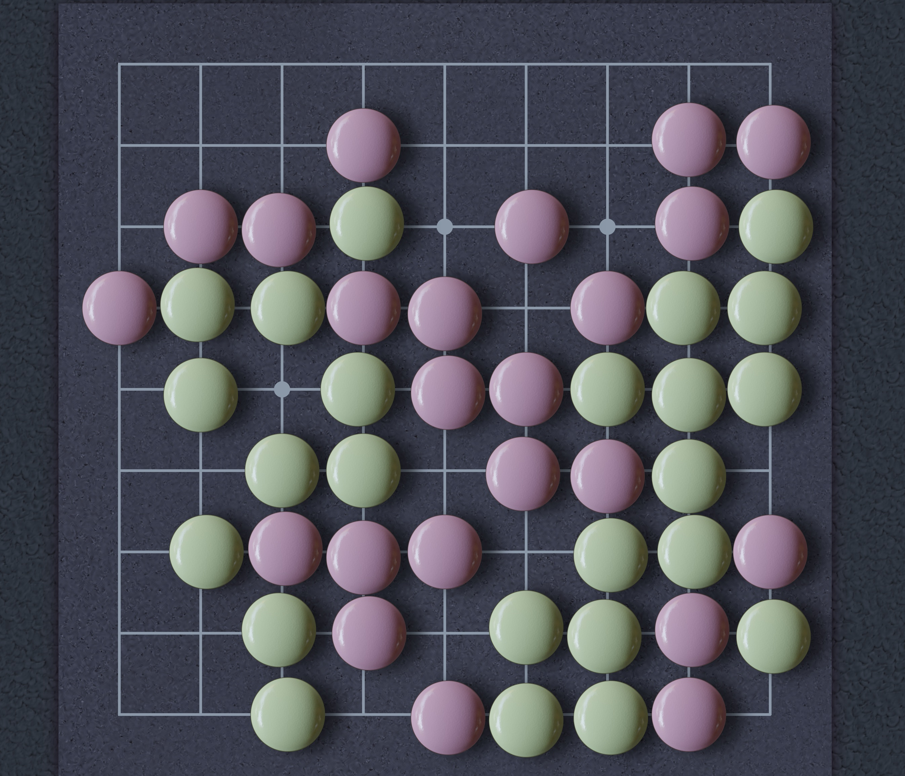

# Sakura Theme for Sabaki

A sakura (cherry blossom) theme inspired by the [Kurigoishiten sakura-go](http://shop.kurokigoishi.co.jp/en/item/1912) set,
for [Sabaki](http://sabaki.yichuanshen.de/),
Rendered in [Blender](https://www.blender.org/).

## Installation

[Download](https://github.com/billhails/SabakiThemes/releases) the theme file and install it directly inside Sabaki
under 'Preferences' > 'Themes' > 'Install Theme...'.

## Build

To create a Sabaki theme archive, install dependencies using npm, then run the build script:

~~~
npm install
npm run build
~~~

This will create `sakura.sabakitheme.asar`.

## License

Everything is released under [public domain](http://creativecommons.org/publicdomain/zero/1.0/).
