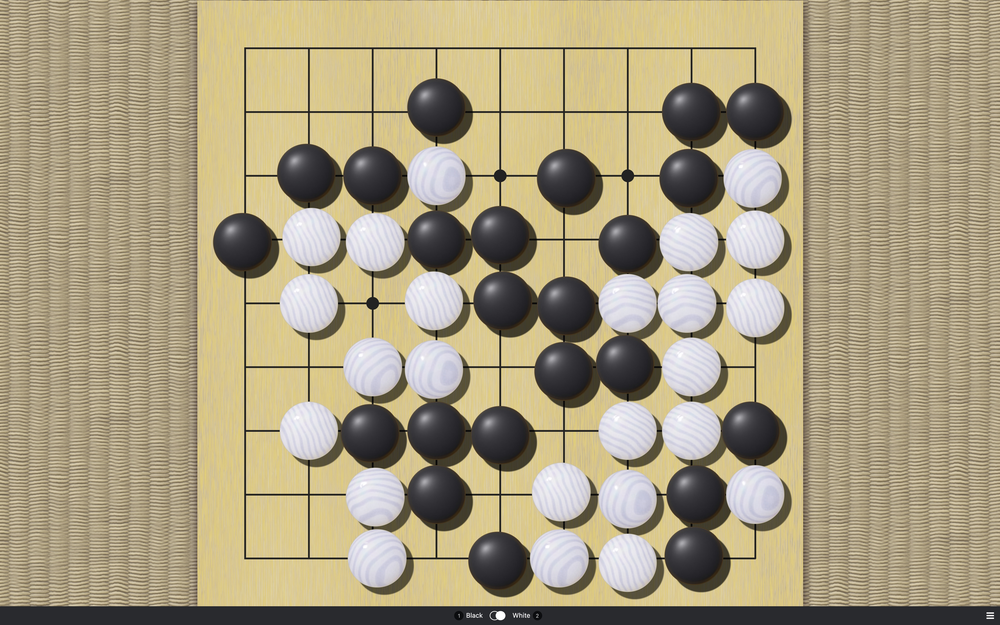

# Clamshell and Slate Theme for Sabaki (Hard Light)

A theme with clamshell and slate stones and
a [Kaya](https://en.wikipedia.org/wiki/Torreya_nucifera) board for [Sabaki](http://sabaki.yichuanshen.de/),
Rendered in [Blender](https://www.blender.org/).
The nacre material of the white stones is based on a material by [ata4](https://www.blendswap.com/blend/10488) (CC-0 license).

## Installation

[Download](https://github.com/billhails/SabakiThemes/releases) the theme file and install it directly inside Sabaki
under 'Preferences' > 'Themes' > 'Install Theme...'.

## Build

To create a Sabaki theme archive, install dependencies using npm, then run the build script:

~~~
npm install
npm run build
~~~

This will create `shell-slate-hard.sabakitheme.asar`.

## License

Everything is released under [public domain](http://creativecommons.org/publicdomain/zero/1.0/).
