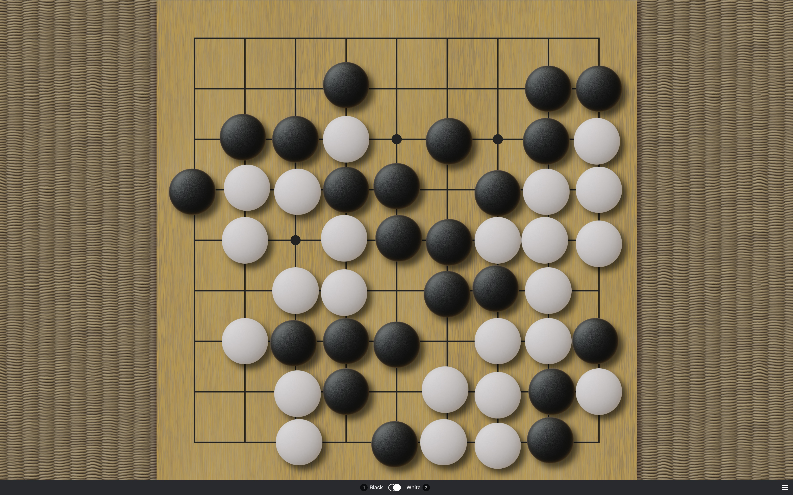

# Alternative Yunzi Theme for Sabaki

A theme with biconvex [Yunzi](https://en.wikipedia.org/wiki/Yunzi) stones and a [Kaya](https://en.wikipedia.org/wiki/Torreya_nucifera) board
for [Sabaki](http://sabaki.yichuanshen.de/). Rendered in [Blender](https://www.blender.org/).

I've used a single consistent HDRI lighting setup for all the components so they should fit together well.

The only actual differennce between this theme and the original is that the white stone is somewhat brighter, and has increased subsurface scattering. I did't want to update the original as it is quite popular.

## Installation

[Download](https://github.com/billhails/SabakiThemes/releases) the theme file and install it directly inside Sabaki
under 'Preferences' > 'Themes' > 'Install Theme...'.

## Build

To create a Sabaki theme archive, install dependencies using npm, then run the build script:

~~~
npm install
npm run build
~~~

This will create `yunzi2.sabakitheme.asar`.

## License

Everything is released under [public domain](http://creativecommons.org/publicdomain/zero/1.0/).
